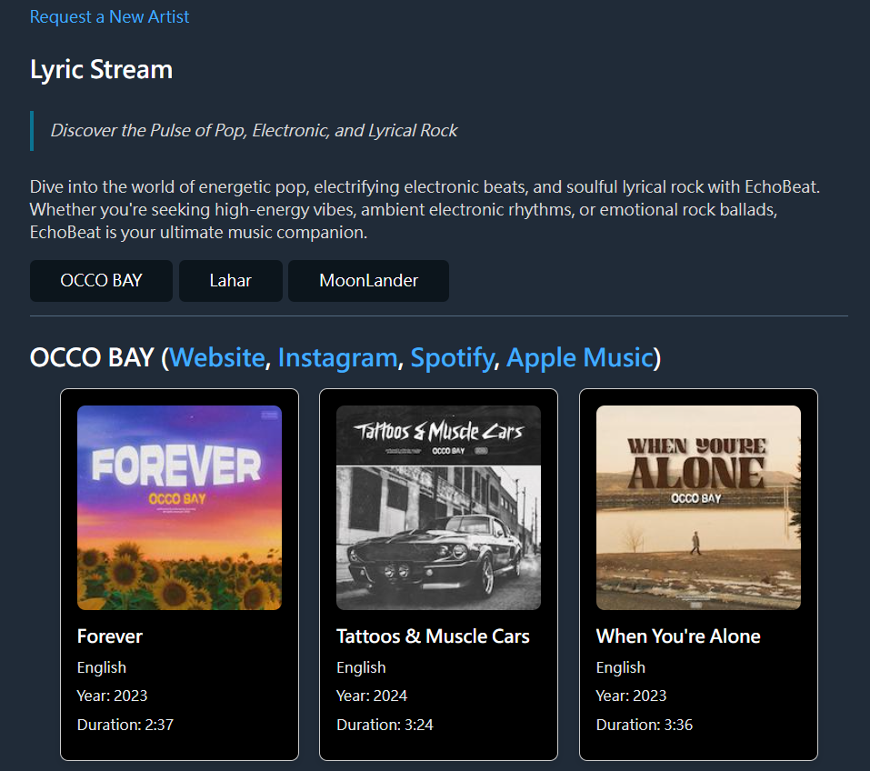

# Lyric-Stream
Lyric Stream is a responsive and feature-rich web application designed to provide users with an efficient platform to explore and interact with curated music content. The application focuses on delivering a clean user experience while ensuring scalability and maintainability through modern web development practices.

# Features
## Comprehensive Artist and Song Management
- **Dynamic Artist Navigation:** Automatically generated artist menu based on dataset, enabling seamless browsing.
- **Detailed Artist Profiles:** Integration with major music platforms (Spotify, Apple Music) and social media (Instagram) for each artist, enhancing discoverability.
- **Song Filtering:** Explicit content is filtered by default, ensuring a family-friendly environment.

## Advanced User Interaction
- **Song Display:** Songs are presented as interactive cards featuring artwork, metadata (release year, duration), and direct links to streaming platforms.
- **Language Support:** Automatic language localization for song information.
- **Artist Request Functionality:** Users can submit requests for new artists with structured data input, including social media links and example works.

## Modern Design and Usability
- **Responsive Layout:** Built with adaptive design principles to support a wide range of devices.
- **Minimalistic Aesthetic:** Powered by Water.css for a clean and professional visual presentation.
- **Newsletter Subscription:** Users can sign up for updates on new music and personalized recommendations.

## Technology Stack
- **Frontend:** HTML5, CSS3 (Water.css framework for classless styling).
- **JavaScript:** ES6+ for dynamic and interactive features, including DOM manipulation and event handling.
- **Data Management:** Modularized artist and song data stored in JavaScript files for easy updates and scalability.

# Key Highlights
1. **Dynamic and Modular Architecture:** The project leverages modular JavaScript files for efficient data handling and scalability, supporting potential future enhancements.
2. **User-Centric Design:** Features like explicit content filtering and customizable artist requests ensure relevance and usability.
3. **Responsive and Accessible:** Fully compliant with responsive design standards, ensuring usability across devices.

# Installation and Deployment
1. Clone the repository:
 ```
 git clone <repository-url>
 cd <repository-directory>
 ```
2. Install dependencies:
 ```
 npm install
 ```
3. Start the development server:
  ```
  npm run dev
  ```

# Demo

  
# Future Enhancements
- Implement server-side data storage for dynamic artist and song management.
- Introduce user authentication for personalized playlists.
- Expand language localization features.